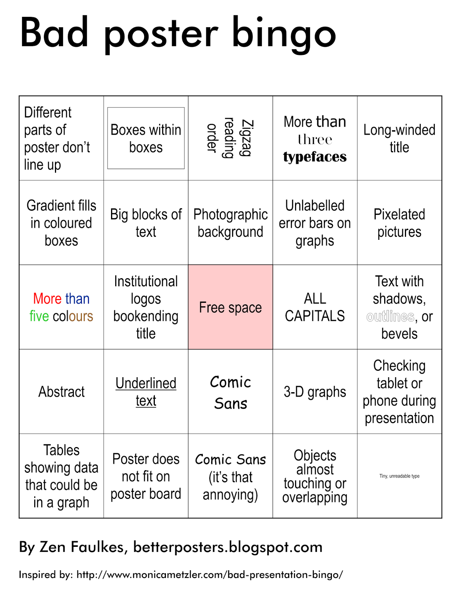

##Making scientific posters

>>>
What is the purpose of a poster presentation?

    Have a conversation about your science.
    <ul>
        <li>Get feedback from experts</li>
        <li>Generate excitement</li>
        <li>Find collaborators</li>
        <li>...</li>
    </ul>

Design your poster for a conversation, not talking <em>at</em> people.

>>>
Who is your audience?

    Tipsy scientist in a hurry.

>>>
Is a poster expository, persuasive, narrative, or descriptive writing?

    Scientific presentations are <em>persuasive</em>. 
    You are making a case that: 
    <ul>
        <li>Your problem is worth solving</li>
        <li>You have solved it</li>
    </ul>

>>>
##Today
<ul>
    <li>Presenting your poster</li>
    <li>Making your poster</li>
</ul>
>>>
###Principles
<ul>
    <li>Woo your audience: people have to choose your poster among many</li>
    <li class="fragment">Be excited about your science</li>
    <li class="fragment">Make your poster a conversation</li>
</ul>
>>>
###In practice
<ul>
    <li>Ask questions, make sure the person is following.</li>
    <li class="fragment">Have a 3 sentence version of your poster</li>
    <li class="fragment">Have a 3 minute version of your poster</li>
    <li class="fragment">Know your data inside and out</li>
</ul>
>>>
##Today
<ul>
    <li>Presenting your poster</li>
    <li>Making your poster</li>
</ul>
>>>
Tell a VISUAL story.  Question.  Hypothesis.  Method.  Results. Conclusion
>>>
Visual principles: 
    <ol>
        <li>Every bit of ink should count</li>
        <li>Each heading/title should be a <em>claim</em> supported by evidence</li>
        <li>Facilitate quantiative comparisons</li>
    </ol>
>>>
 height="55%" width="55%"
>>>
Erase, erase, erase.
>>>
 100000000000,010000000000,001000000000,000100000000,000010000000,000001000000,000000100000,000000010000,000000001000,000000000100,000000000010,000000000001
>>>
<ul>
    <li>Never go below 30 point font</li>
    <li>Never have an image below 300 dots per inch, or a graphic smaller than 4x4 inches.</li>
    <li>Use a vector graphics program like Illustrator or Inkscape (free), <bold>not</bold> Powerpoint</li>
</ul>
>>>

